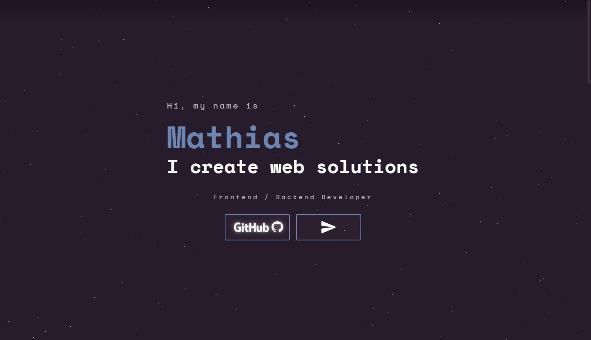

# Mathias Skauen Harestad's Portfolio

## Welcome!

This repo is created for my one and only web portfolio!

The project is still under development, but feel free to install the project yourself.\
Or check it out at http://mskauen-portfolio.herokuapp.com/

## How to run
* Run command `` npm install ``
* Run command `` npm start `` / ``npm run start``
* Go to [http://localhost:8080](http://localhost:8080) in browser. 
* Go to [http://localhost:1234](http://localhost:1234) for parcel access if running in dev mode
  *  ``npm run start:dev``

* For troubleshooting, see "Troubleshooting" below.

## To Do
* Create an about me section
* Maybe create some CRUD operations?
    * Blog posts and/or comments?

### UI/UX
* Full web responsiveness (WIP)
    * Mobile, tablet, etc..

## Troubleshooting

* Check parcel version.
* Restart parcel ``npm run start:dev``
* Delete ``.parcel-cache`` directory.
* Run `npm install` - perhaps also delete the `node_modules` directory.
* Delete ``dist`` folder if changes are not appearing on page.
* Deleting the ``.idea`` folder may also fix some issues.

### Heroku
Use ``heroku logs --tail -a <Heroku app name>`` to check heroku logs

#### Noteable Errors
* H10 
    * 'error code=H10 desc="App crashed" method=GET path="/"'
    * Use ``heroku ps:scale web=1 -a <Heroku app name>`` to scale dynos and fix error.

## Available Scripts

In the project directory, you can run:

### `npm run start:dev`

Runs the app in the development mode.\
Open [http://localhost:1234](http://localhost:1234) to view it in your browser.

This page will reload automatically when you make changes.\
You may also see any lint errors in the console.

### `npm start`

Builds a packaged and optimized production build without parcel.\
Open [http://localhost:8080](http://localhost:8080) to view it in your browser.

